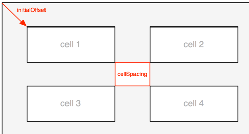

# ARFramesInGridCalculator

[](http://cocoadocs.org/docsets/ARFramesInGridCalculator)
[](http://cocoadocs.org/docsets/ARFramesInGridCalculator)
[](http://cocoadocs.org/docsets/ARFramesInGridCalculator)

## Introduction

This simple tool is used in every app I ever did. It is nothing fancy, just convenience. I like things nicely aligned, and this makes it really easy. Once you've tried it, you'll be hooked.

## Description

ARFramesInGridCalculator a single class that makes it really easy to create frames in a grid, for buttons, images, textfield, .. whatever. Something most developers have to do many times to order and display a list of items.

Initialize with a cell size and information about how to arrange the frames. Optionally add a initial offset and spacing and once it is set to your specific needs, you can just ask a frame for a certain index.



## Usage

The method `frameForIndex:` is what you will use most.

```
	for (int i = 0; i < 14; i ++)
	{
		UILabel *test = [[UILabel alloc] initWithFrame:[framesInGridCalculator frameForIndex:i]];
		[self.gridContainerView addSubview:test];
	}
```


I've added methods that will help you get the right sizes:

- When placing cells within a limited width, this will calculate the corresponding cellWidth.
`widthForTotalWidth:count:horizontalMargin:`

- For a given cell width and totalWidth, calculate spacing for even layout.
`horizontalSpacingForTotalWidth:cellWidth:count:`


## Installation

ARFramesInGridCalculator is available through [CocoaPods](http://cocoapods.org). To install
it, simply add the following line to your Podfile:

    pod "ARFramesInGridCalculator"

## Author

Gijs van Klooster, gijs@appyroad.com

## License

ARFramesInGridCalculator is available under the MIT license. See the LICENSE file for more info.

